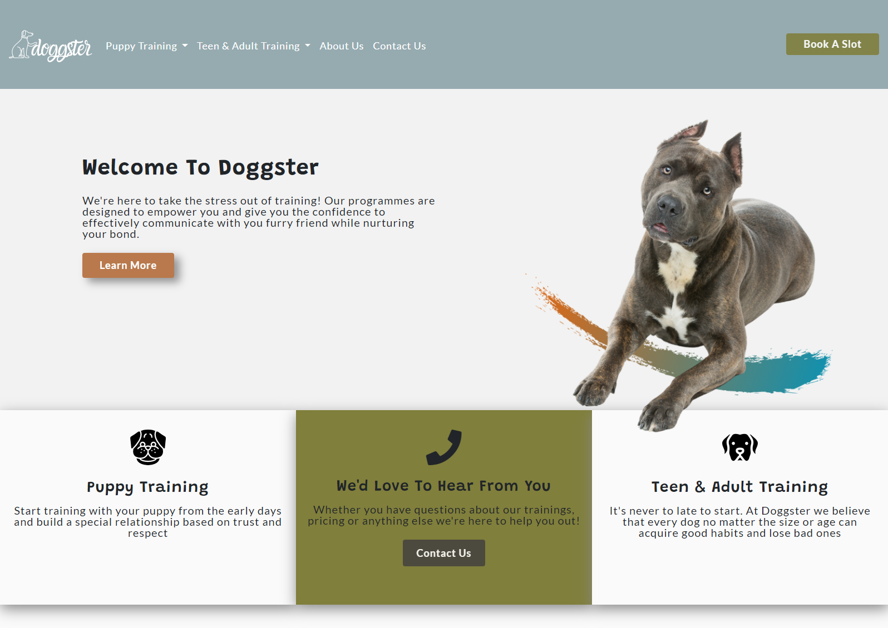
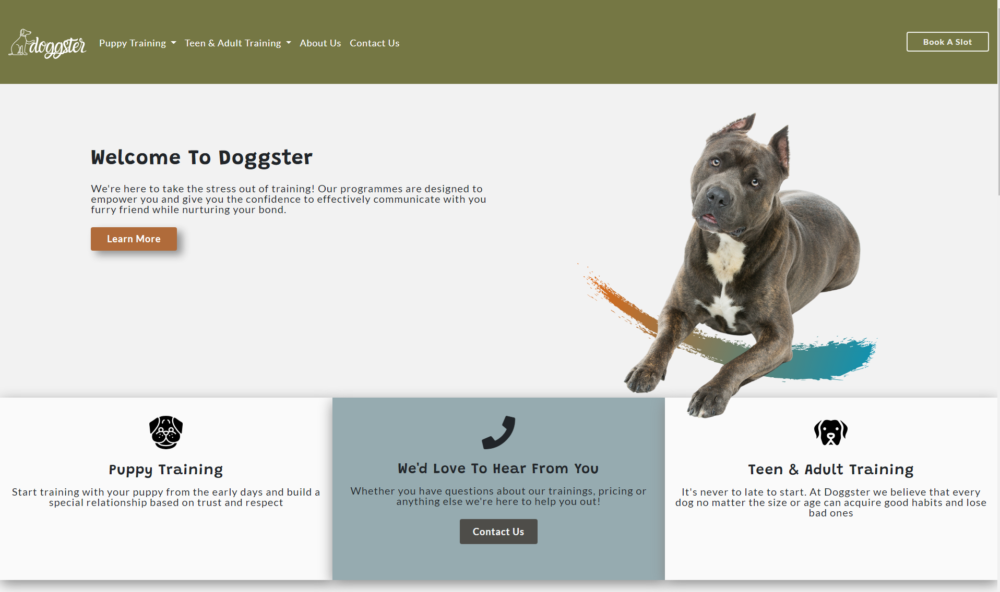
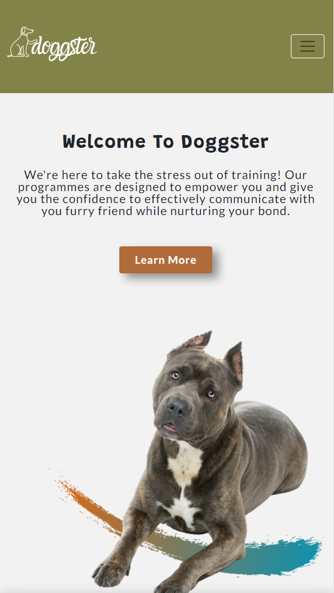
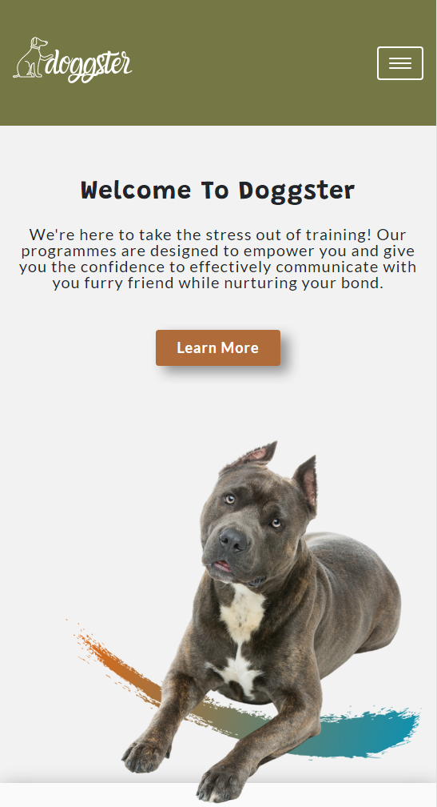

 
# **DOGGSTER**

Welcome to Doggster! We are excited to be guiding you and your best friend in forming a special bond nurtured with love and respect. Every pooch is a part of our evergrowing family, and we always give 100% commitment to their training and exercise. Our primary focus is to understand your dog before we start with any training, and we believe every dog can 
learn to behave in the right way and listen to their owners.

### **Table of Contents**

- Business intro
- UX
- Project Goals
- Use cases
- Research & Design Phase
- UX Documents
- Features
- Technologies Used & Resources

## **UX**

The perfect client for this business is a person who owns a dog, and it's looking for the training services. The age & size of the dog is not essential, which allows a broader scope of potential clients. Copy on the website is friendly focused, which could indicate to 
clients that their dog will have fun and be in a safe environment while training.

#### <ins>Project Goals</ins>

- For new clients the goal is to contact us to find out more about available trainings and about us as a business

- For exsisting clients the goal is to make booking the training sessions as seemless as possible.

#### <ins>Use cases:</ins>
* Puppy owners: People who are looking to start training their pups from the early stages of their life.
* Adult dog owners: People who have any sort of problem/difficulties with their dogs(aggression, behaviour issues, etc.), or are just looking for advanced training.
* People who are looking for a daycare to leave their dog while they're in work.
* People that wish to teach their dog a little bit extra(tricks, listening to orders etc.)

#### <ins>Research & Design Phase</ins>

I have carried out a competitor analysis to get an understaning of what other businesses are doing. Purpose of the research was to discover more about what type of the services are offered and about the terminology
used in dog training bussiness.

*For the inspiration & business information I've used 3 different websites*

- [Pawfection](https://pawfectiondogtraining.ie/)
- [Alpha Dog Training](http://alphadogtrainingcenter.com/)
- [School For The Dogs]("https://www.schoolforthedogs.com/")

*Color scheme & Fonts*

Colors are selected based on their symbolism and suitability for the dog training business. 
Each color impacts overall user impression and changes their way of feeling abot the website.

Fonts are paired nicely. All the titles are in Grandtsader & body text is in Lato font.

#### Documents

- [Site Map]()

- [Color Scheme & Fonts Document](https://github.com/Boki136/Doggster-Dog-Training-School/blob/master/UX/Colour%20Pallet%20And%20Fonts.png)

- [Wireframes](https://github.com/Boki136/Doggster-Dog-Training-School/tree/master/UX/wireframes)

## **Features**

Website consist seven pages:

- Homepage 
- About Us 
- Contact Us
- Puppy Private Sessions
- Puppy Day School
- Adult Agility Traning
- Adult Day School
- Testing
- Issues I couldn't overcome
- Acknowledgments 

<ins>**Navigation**</ins>

Navigation consists logo, links to all the pages and "Book A Slot" CTA.
On small screens social icons are listed in the menu.

<ins>**Footer**</ins>

Newsletter sections gives us the abiliity to capture email addresses and grow email marketing list.
We can utilize on promotions and sales offers we are sending to opted clients.

Easy accessible support information and service links.

<ins>**Homepage**</ins>

Idea behind "Learn More" CTA is to prompt potential new clients to explore more about who we are and what the bussines is about and not showcase services & price side of things. 
Second section of the page explains a little bit about the service offering and has a CTA "Contact Us" for the purpose of client reaching out to us and learning more about the business and possibly booking in a training session.

 The rest of the page is content oriented without any actions user can take - interesting facts are focused on dog lovers who enjoyy reading exciting facts about dogs.
 Why Choose Us sections offers more insight to our qualities and differences from the competitors - Flipboxes are used for clean look and to save up space on the page.
 On mobile devices boxes are flipped automatically to prevent bad user experience.

<ins>**About Us**</ins>

This page is content focused. Parallax Scrolling Effect gives a nice feel to story telling.
User can find out more about bussiness values and each team member.
Each trainer has a brief description about them & their special skills, also their certifications are linked to a supported articles which are explaing the meaning 
of each certificate.  

Testimonials section is focused on showcasing business credibility and level of expertise.

<ins>**Service Pages**</ins>

Layout is consistent across all service pages. Each page contains detailed information about each training sessions and also shows different
training packages. Repetative "Book A Slot" CTA's in Nav and Pricing section of the page sets emphasis on user to take action and books a training session.

<ins>**Contact Us**</ins>

Contact us page offers various ways of contacting our support team. User can fill in the contact form, call or Email Us.
Google map is helping the user to easily locate where we're based.

## **Technologies Used & Resources**

#### 1. Languages

 **HTML5**

  **CSS3**

#### 2. Integrations & Frameworks

  **Bootstrap**

 **Font Awsome**

 **Google Fonts**

#### 3. Workspace, version control and Repository storage

  **GitPod** - All code is written in gitpod cloud enviroment, coomited and pushed to GitHub

 **Git** - Distributed Version Control tool to store versions of files and track changes.

 **GitHub** - A cloud-based hosting.

#### <ins>**Resources**</ins>

- Canva & Flat icon were used for image sourcing
- Adobe XD - used for wireframing
- Lucidchart - used for sitemap
- Bootstrap Documentation - used for code snippents and support
- Stack Overflow - General resource for code and problem solving
- W3 School - General resource for code and problem solving

## Testing

i. Responsiveness is tested on all screen sizes all the way down to 320px. I've reduced font-size on some elements to improve mobile user experience.
All elements are rendering fine, there's no broken links or images

ii. Accessibility tested with WAVE Web Accessiblity Tool:

    - the result showed errors in color contracts in the Navbar and service boxes on the HomePage

   **BEFORE**

 

 **AFTER**

  

    - hamburger menu icon changed to white due to poor color contrast

**BEFORE**

 

 **AFTER**

  

  iii. Missing label tags on some input fields. Issue fixed to avoid confusing the screen reader.
  All icons are hidden for screen readers & each image has the alt tag.

iv. CSS Validator showed 3 erros:

    - missing semicolon on two lines
    - inavlid background property (background-repeat-x: no-repeat;)
    -missin closing bracket on media query

    Css also shown warings about 'unknown vendor extension' - they are fine to leave as is (reference stack overflow)

v. HTML Validator

    - validator showed errors for a tags I've used in Ul elemetn without nesting them to li tags firts.
    - unessecarry use of type="submit" attribute in some of the a tags (previously bootstrap buttons)

## Issues I couldn't overcome

- boostrap navbar seems to glitch on small screens. When expadning it goes to original form and then it applies bespoke styling so the glitchis visible for 
a second.
- Invalid background property (background-repeat-x: no-repeat;) - code editor is giving a warning message that the property doesn't exsist but it works in the browser and dev tools.

## Acknowledgments 

- special thanks to my mentor Narender Singh for the guidance & encouragement.
- thanks to slack community and CI staff